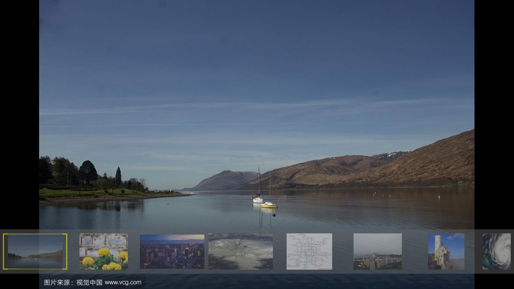

# QT QML Image Provider for ALI platform

This is a [QT QML image provider](http://doc.qt.io/qt-5/qquickimageprovider.html) using ALI Graphic Engine for rendering JPEG, PNG, GIF and BMP photos.

## Compiling in ALI BuildRoot

```shell
cd /path/to/ali/buildroot/output/build/
git clone https://github.com/minyuwang/sked-image-provider-ali.git
cd sked-image-provider
./br_ali.sh clean
./br_ali.sh qmake
./br_ali.sh make
./br_ali.sh install
```

## Running example in ALI board

The example browers photos under path `/media/sda1/photos`.
Some test photos can be downloaded from [here](https://pan.baidu.com/s/1jPv2uMJFtB7GkBDkC4JYzw)

1. copy photos to `/media/sda1/photos`
1. run `/opt/sked/imageprovider/bin/skedimageprovider-example -platform directfb -plugin evdevkeyboard`

Captured UI of the example:


